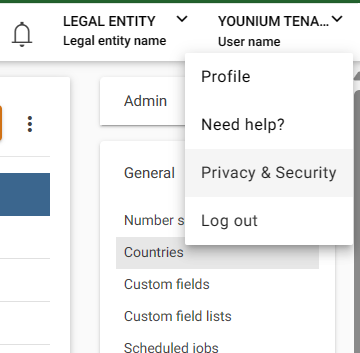

# Get started

To use the younium API each request will need to be authenticated using a JWT access token. This guide describes how to generate the necessary credentials and how to acquire the JWT token to enable using the younium APIs. If you need to authenticate with a legacy user, using username and password a guide can be found [here](https://developer.younium.com/get-started-legacy#U8eBS) but this method is obsolete and will be deprecated.

It’s recommended to authenticate to the API using the client credentials generated from the API Token. If you cannot log on into Younium using SSO/MFA with your user, you will need to be migrated to the new authentication platform. Please contact your Younium customer success manager.

Regardless of the authentication method, a user is required and any user with sufficient permissions for your use case can be used. However, it’s recommended when developing automated solutions and integrations to have a dedicated API user set up.

## Generating an API token and client credentials

1. Open the user profile menu in the top right of the screen by clicking your name, select “Privacy & Security”.

<figure><figcaption></figcaption></figure>

2. Select “Personal Tokens” in the panel to the left and click “Generate Token”.

<figure><figcaption></figcaption></figure>

3. Write a relevant description Click “Create”

<figure><figcaption></figcaption></figure>


4. The Client and ID and Secret key is now generated and be visible. Make sure to copy the values now since they will never be visible again. These credentials will be used to generating the access JWT token

<figure><figcaption></figcaption></figure>

## Generating A JWT token

The jwt access token is acquired via a POST request to the /auth/token endpoint with the provided header and body.

Sandbox: [api.sandbox.younium.com/auth/token](https://developer.younium.com/get-started)

Production: [api.younium.com/auth/token](https://developer.younium.com/get-started)

### Request header

```
Content-Type: application/json
```

### Request body

```
{ 
    "clientId": [Client ID], 
    "secret": [Secret key] 
}
```

If all credentials are valid the request will return the following response containing the `accessToken` which will be used to authenticate to the API.

```
{
    "expires": "Thu, 21 Mar 2024 11:12:01 GMT",
    "expiresIn": 86400,
    "accessToken": "eyJhbGciOiJSUzI1NiIsInR5cC...",
    "refreshToken": "4baf4774-5ef9-4983-a8d8-f4fdae7f7000"
}
```

The access token is valid for 24 hours after which a new token will need to be acquired.

If the the credentials provided are not valid or other errors occur a response with code 400 or 401 will be returned with an error message describing the error:

```
error: [Error message]
```

### Example request in Postman

<figure><figcaption></figcaption></figure>

## Making Authenticated calls to the Younium API

The access token received from a successful authentication will then be used to make authenticated calls to the Younium API.

All requests to the Younium API should have the following HTTP Headers:

```
Authorization: Bearer [JWT token]
Content-Type: application/json
api-version : [version] (optional but recommended)
legal-entity: [legal entity id or Name]
```

### Specifying legal entity

Specifying the `legal-entity` header allow you to read and write to the desired legal entity and will be required to specify if your tenant have multiple legal entities.\
If the provided legal entity cannot be found under the tenant a 403 Forbidden response will be returned.

Example request to GET /accounts with all headers in postman

<figure><figcaption></figcaption></figure>

### Versions

The header api-version may be set to specify which version of the api to be called. By default version 2.1 will be called.

[**Read more about different versions**](https://developer.younium.com/developer-resources#jJK1f)

### Common errors related to authentication

In most cases an error message indicates why an error is thrown but a message is absent or unclear the below cases can give a general idea of the issue.

* 401 Unauthorized response: Generally indicates an expired, missing or incorrect access token.
* 403 Forbidden response: Indicates that the request is authorized but the action is forbidden. This may occur if:
  * legal entity provided in the header is empty, invalid or incorrect
  * If the user is missing permission to access a resource. This can be solved bu changing the permissions in the UI
  * Issue with accessing connected integrations or services.

[**Read more about how the API works**](https://developer.younium.com/developer-resources)

[**API references**](https://developer.younium.com/get-started)
